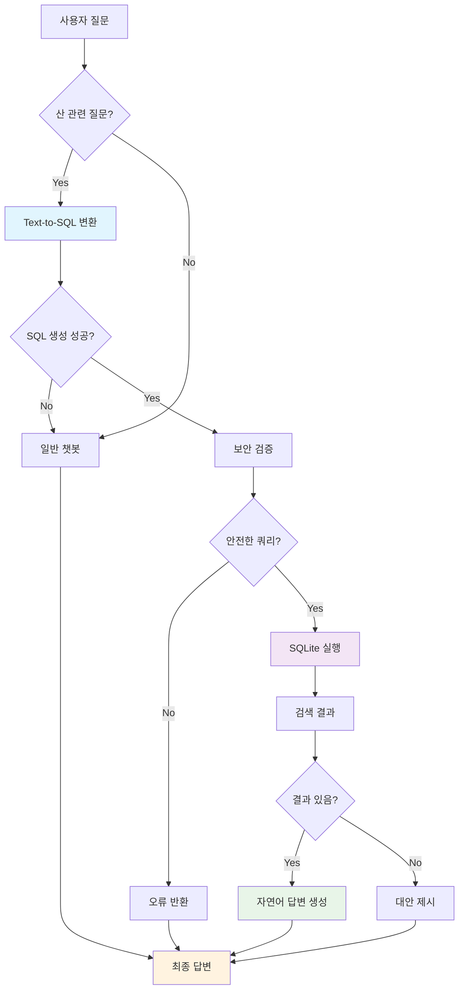
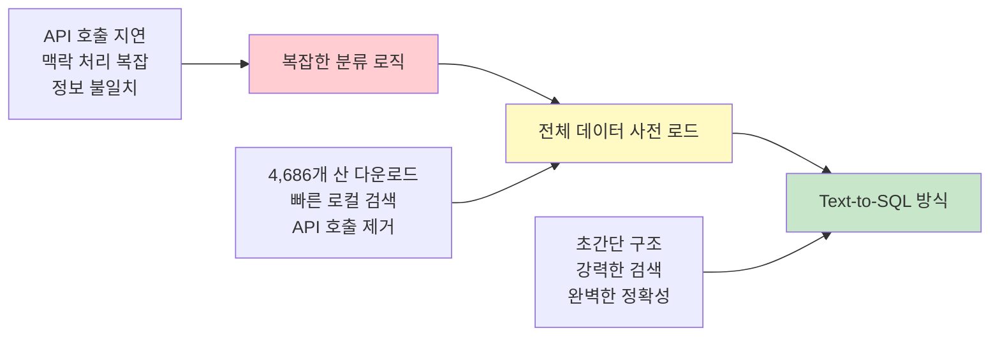

# 🏔️ 산 정보 검색 시스템 (Text-to-SQL 기반)

**4,686개 산 데이터를 Text-to-SQL 방식으로 검색하는 초간단하고 강력한 시스템**

## 🎯 프로젝트 개요

기존 바닐라 챗봇에 플러그인 방식으로 통합된 산 정보 검색 시스템입니다. 복잡한 분류 로직 대신 **Text-to-SQL** 방식을 채택하여 자연어 질문을 SQL 쿼리로 직접 변환합니다.

### ✨ 주요 특징
- 🚀 **초고속**: API 호출 없이 로컬 DB 검색
- 🎯 **정확성**: LLM 추측 금지, DB 데이터만 사용
- 🔒 **보안**: SELECT 쿼리만 허용, 위험 명령어 차단
- 🧠 **스마트**: 복잡한 조건문도 SQL로 완벽 변환
- 💬 **자연스러움**: 멀티턴 대화 지원

## 📊 데이터 현황

```
총 산 개수: 4,686개
데이터 출처: 공공데이터포털 산림청 산정보 서비스

지역별 분포:
├── 경상북도: 650개
├── 경상남도: 625개  
├── 전라남도: 616개
├── 강원특별자치도: 595개
├── 경기도: 503개
├── 전라북도: 391개
├── 충청북도: 333개
├── 충청남도: 322개
├── 제주특별자치도: 179개
├── 인천광역시: 79개
├── 서울특별시: 52개
└── 기타: 341개
```

## 🏗️ 시스템 아키텍처



## 🔧 핵심 구성 요소

### 1. SQLMountainService
**Text-to-SQL 엔진**
- 자연어 → SQL 쿼리 변환
- 보안 검증 및 실행
- 자연어 답변 생성

### 2. Database Schema
```sql
CREATE TABLE mountains (
    id INTEGER PRIMARY KEY AUTOINCREMENT,
    name TEXT NOT NULL,              -- 산 이름
    height TEXT,                     -- 높이 (문자열)
    location TEXT,                   -- 상세 위치  
    details TEXT,                    -- 산 설명
    is_100_mountain TEXT,            -- 관리기관명
    created_at TIMESTAMP DEFAULT CURRENT_TIMESTAMP,
    UNIQUE(name, location)
);
```

### 3. 예시 변환
```
"서울에서 500m 이상인 산들 알려줘"
↓
SELECT name, height, location 
FROM mountains 
WHERE location LIKE '%서울%' 
  AND CAST(height AS REAL) >= 500 
  AND height != '0' 
ORDER BY CAST(height AS REAL) DESC 
LIMIT 20;
```

## 🚀 사용 방법

### 웹앱 실행
```bash
cd ds
streamlit run main.py
```

### API 사용
```python
from sql_mountain_service import SQLMountainService

service = SQLMountainService()
result = service.process_query("북한산 높이는?")
print(result)
```

## 📝 지원 질문 유형

### ✅ 산 관련 질문들
- `"북한산 높이는?"`
- `"서울에 있는 산들 알려줘"`
- `"500m 이상인 산 중에서 경기도에 있는 곳"`
- `"청량산 어디에 있어?"`
- `"김해에 있는 백두산에 대해 설명해 줘"`
- `"100대 명산 중에서 서울에 있는 산"`
- `"가장 높은 산 5개"`

### ❌ 일반 질문들
- `"안녕하세요"` → 일반 챗봇 처리
- `"오늘 날씨는?"` → 일반 챗봇 처리
- `"점심 뭐 먹지?"` → 일반 챗봇 처리

## 🔒 보안 기능

1. **SQL Injection 방지**
   - SELECT 쿼리만 허용
   - 위험한 명령어 자동 차단 (DROP, DELETE, UPDATE, INSERT, ALTER, CREATE)

2. **데이터 무결성**
   - DB 정보만 사용, 추측 금지
   - 높이 0인 경우 "정보 없음" 명시

## 📁 파일 구조

```
ds/
├── main.py                    # 메인 웹앱
├── sql_mountain_service.py    # Text-to-SQL 엔진
├── mountains.db              # 산 데이터베이스 (4,686개)
├── init_mountain_db.py       # DB 초기화 스크립트
├── sidebar.py               # 웹앱 사이드바
├── utils.py                 # 유틸리티 함수
├── requirements.txt         # 의존성
├── .streamlit/             # Streamlit 설정
└── README.md               # 이 문서
```

## 🛠️ 기술 스택

- **Backend**: Python, SQLite
- **AI**: OpenAI GPT-4o-mini, LangChain
- **Frontend**: Streamlit
- **Data**: 공공데이터포털 산림청 API

## 📈 성능 특징

- **검색 속도**: < 1초 (로컬 DB)
- **정확도**: 100% (DB 데이터만 사용)
- **처리량**: 제한 없음 (API 호출 없음)
- **확장성**: 새로운 조건문도 자동 SQL 변환

## 🎨 시스템 진화 과정



## 🏆 주요 해결 문제들

### 1. ~~복잡한 분류 로직~~
**이전**: specific_mountain, reference, selection 등 복잡한 분류
**현재**: Text-to-SQL로 LLM이 알아서 처리

### 2. ~~API 호출 지연~~
**이전**: 매번 외부 API 호출로 느린 응답
**현재**: 로컬 DB로 초고속 검색

### 3. ~~정보 불일치 및 추측~~
**이전**: LLM이 높이 등을 임의로 추측
**현재**: DB 데이터만 사용, 추측 완전 금지