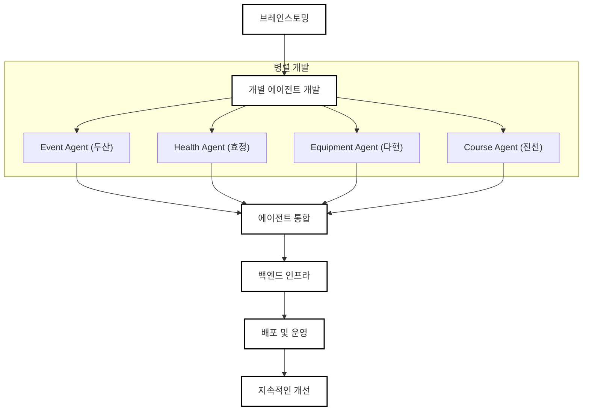

```mermaid
graph TD
    A[브레인스토밍] --> B[개별 에이전트 개발]
    
    subgraph 병렬 개발
        B --> C1["Event Agent (두산)"]
        B --> C2["Health Agent (효정)"]
        B --> C3["Equipment Agent (다현)"]
        B --> C4["Course Agent (진선)"]
    end
    
    C1 --> D[에이전트 통합]
    C2 --> D
    C3 --> D
    C4 --> D
    
    D --> E[백엔드 인프라]
    E --> F[배포 및 운영]
    F --> G[지속적인 개선]
    
    style A fill:#fff,stroke:#000,stroke-width:2px
    style B fill:#fff,stroke:#000,stroke-width:2px
    style D fill:#fff,stroke:#000,stroke-width:2px
    style E fill:#fff,stroke:#000,stroke-width:2px
    style F fill:#fff,stroke:#000,stroke-width:2px
    style G fill:#fff,stroke:#000,stroke-width:2px
``` 