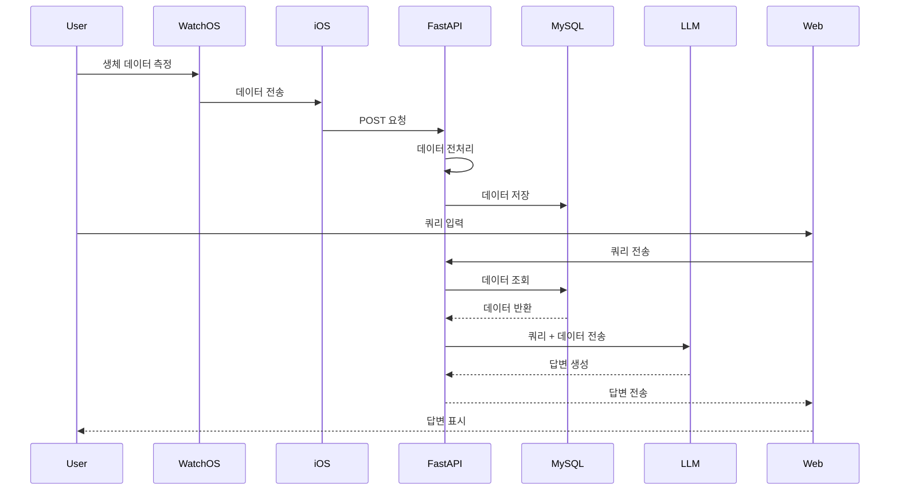

```mermaid
sequenceDiagram
    participant User
    participant WatchOS
    participant iOS
    participant FastAPI
    participant MySQL
    participant LLM
    participant Web

    %% 생체 데이터 측정 및 저장 흐름
    User->>WatchOS: 생체 데이터 측정
    WatchOS->>iOS: 데이터 전송
    iOS->>FastAPI: POST 요청
    FastAPI->>FastAPI: 데이터 전처리
    FastAPI->>MySQL: 데이터 저장

    %% 쿼리 처리 흐름
    User->>Web: 쿼리 입력
    Web->>FastAPI: 쿼리 전송
    FastAPI->>MySQL: 데이터 조회
    MySQL-->>FastAPI: 데이터 반환
    FastAPI->>LLM: 쿼리 + 데이터 전송
    LLM-->>FastAPI: 답변 생성
    FastAPI-->>Web: 답변 전송
    Web-->>User: 답변 표시
``` 